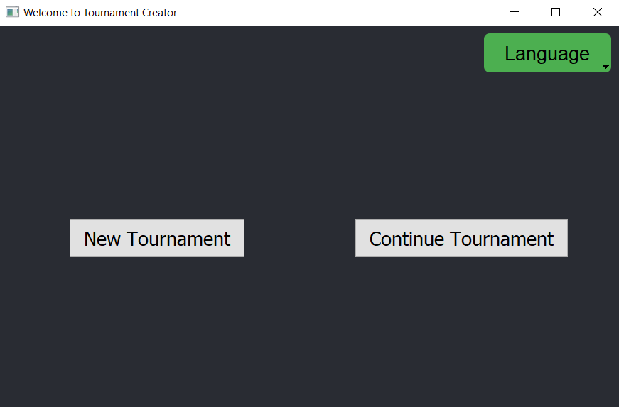
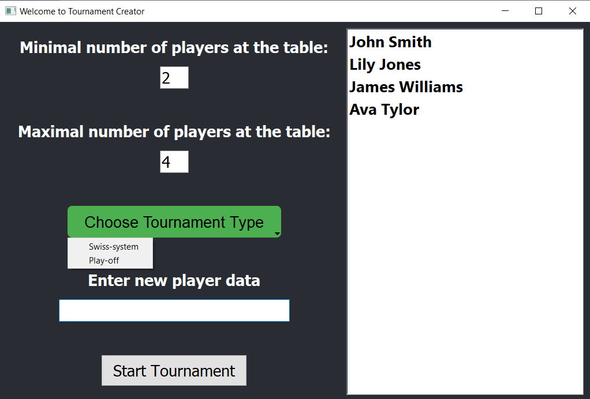
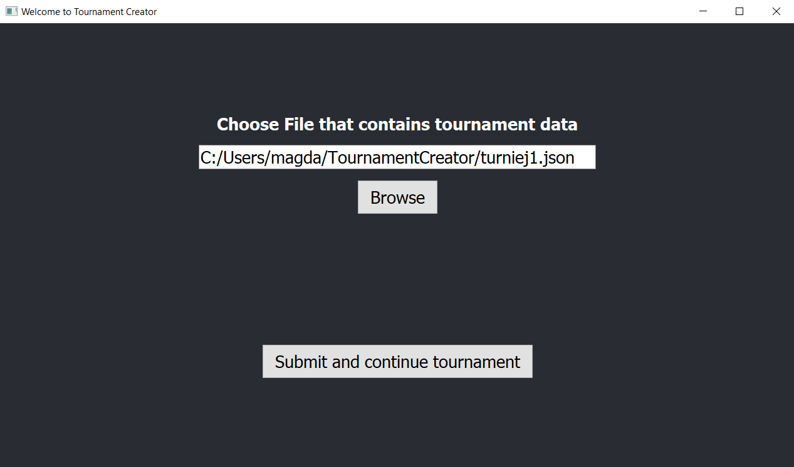
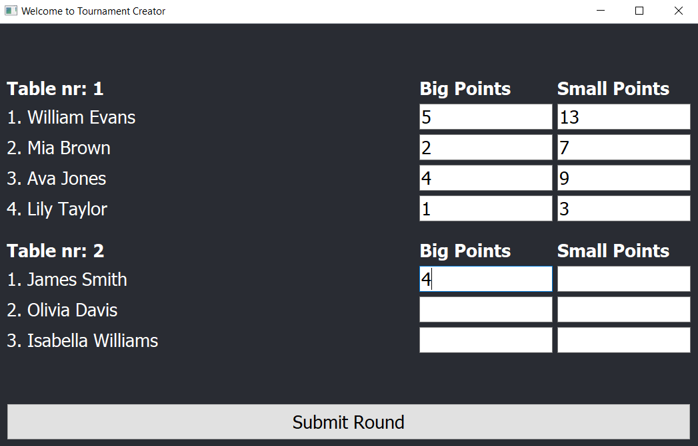
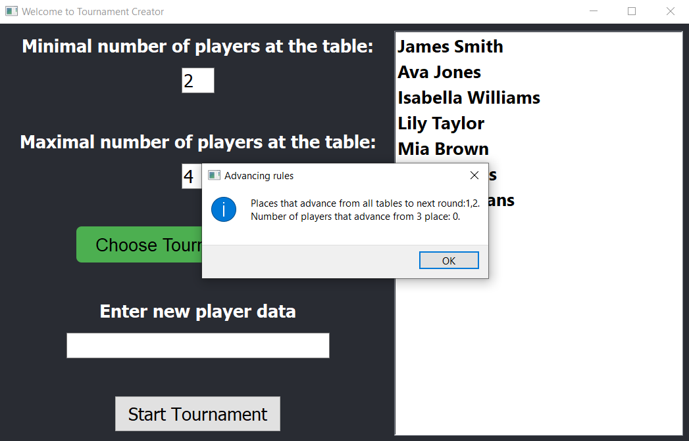
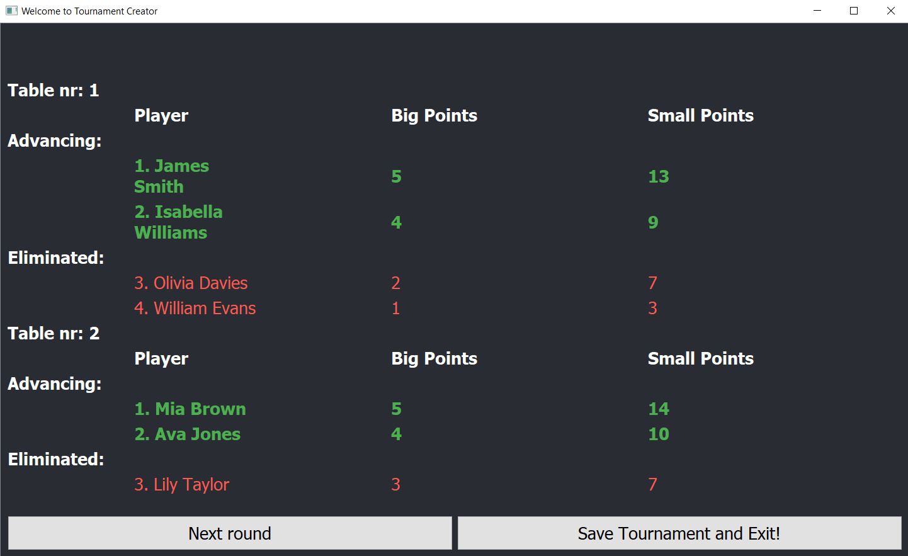
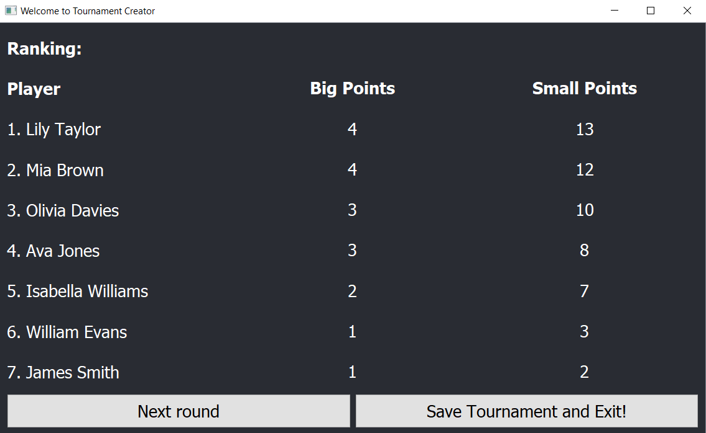

# Tournament Creator

This app is created to help with organising and managing tournaments, especially boardgame ones. It was developed using Python and PyQt5 library.

In our program we adapted clasic tournament systems to work not only for 1:1 games, but also for multiplayer games.

## Features

This program let's you:
- **Create a list of players**
- **Choose one of two tournament types:** Swiss or Single Elimination
- **Decide how many players can be at the table**
- **Easily add points to every player** both big and small if you need
- **Save the tournament and load it again later** with all points saved

The app will take care of the rest. It will automaticaly:
- **Divide players to tables:** as optimal as possible
- **Give each player an exact seat at the table:** we know that some games favour first/last player
- **Calculate points, show results and create next round**
- **Inform how many players will advance and inform when the final round starts** in Single Elimination system

## 🛠️ Technologies

- **Language:** Python
- **Libraries:** PyQt5, sys, math, json
- **IDE:** VS Code (with recommended extensions)

## 🚀 Install and run

To install the app on **Windows**, go to the [releases page](https://github.com/TheL1su/TournamentCreator/releases/tag/v1.0.0) and download the `.exe` file.

**Linux** version coming soon.

## 📸 Screenshots

**Starting Page**

**You can start a new tournament**

**Or load an existing one**

**Division to tables and filling results is intuitive**

**And all important information is given at the beginning of a round**

**Depending on the system results show clearly:**
- **Which players advance in Play Off**

- **Places and points in Swiss**

## 📄 License

The project was made by [Magda-Gr](https://github.com/Magda-Gr) and [TheL1su](https://github.com/TheL1su).
